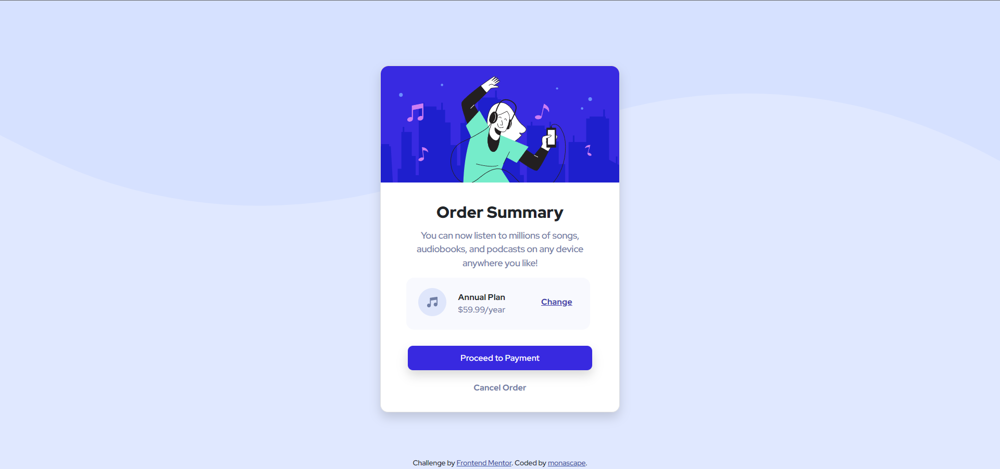

# Frontend Mentor - Order summary card solution

This is a solution to the [Order summary card challenge on Frontend Mentor](https://www.frontendmentor.io/challenges/order-summary-component-QlPmajDUj). Frontend Mentor challenges help you improve your coding skills by building realistic projects. 

## Table of contents

- [Frontend Mentor - Order summary card solution](#frontend-mentor---order-summary-card-solution)
  - [Table of contents](#table-of-contents)
  - [Overview](#overview)
    - [The challenge](#the-challenge)
    - [Screenshot](#screenshot)
    - [Links](#links)
  - [My process](#my-process)
    - [Built with](#built-with)
    - [What I learned](#what-i-learned)
    - [Continued development](#continued-development)
    - [Useful resources](#useful-resources)
  - [Author](#author)

## Overview

### The challenge

Users should be able to:

- See hover states for interactive elements

### Screenshot

### Links

- Solution URL: (<https://github.com/monascape/Order-Summary-FrontEnd-Mentor-Challenge>)
- Live Site URL: (<https://monascape.github.io/Order-Summary-FrontEnd-Mentor-Challenge/>)

## My process

### Built with

- Semantic HTML5 markup
- CSS custom properties
- [Bootstrap v5.1](https://getbootstrap.com/)

### What I learned

Learnt how to use bootstrap combined with CSS, making it easier to deal with some lines of codes. It was a huge challenge for me, especially the pricing area where I had to figure out how to put all the elements together and I had no idea how. But I did it (took me 2 days but hey, I DID IT! :D)

### Continued development

- There's a lot of room for improvement using bootstrap and taking advantage of it in any way possible;
- Make my code more readable and more flexible, reusing as much as possible without making it super complicated to read;
- *Mentality Improvement*: don't be so stubborn, Google is my friend and I should take advantage of it - although it is really rewarding figuring out on your own but definitely should check it when you take too much time trying to find a way to do x or z.

### Useful resources

- [MDN](https://developer.mozilla.org/en-US/) - It's always a good to find what you could do or definitely, not do!
- [Shay Howe](https://learn.shayhowe.com/html-css/positioning-content/) - Saved me when I was stuck with the pricing part with the positioning, even though I saw it before I was trying to do it with rows and cols but it was so much easier and I felt silly after I read the page. And if he ever sees this, awesome content btw!
- [Coding Yaar](https://codingyaar.com/bootstrap-profile-card-1/) - I was using the bootstrap for the shadow but as my card radius was bigger than the shadow radius by Bootstrap and it had a small border showing around the corner and I didn't that (it looked bad, even though you barely could see it, it was looking bad!') I found this website where it helped me use the right radius for my shadow. Thank you!
- [Fireship](https://www.youtube.com/watch?v=lPJVi797Uy0) - Helped me understand SVG and gave me a huge website tip to use to design your own curves. Also the best!
- [Shape Divider](https://www.shapedivider.app/) - website to create your own svg, absolutely awesome!

## Author

- Linkedin - [monascape](https://www.linkedin.com/in/monascape/)
- Frontend Mentor - [@monascape](https://www.frontendmentor.io/profile/monascape)
- Twitter - [@monascape](https://www.twitter.com/monascape)

